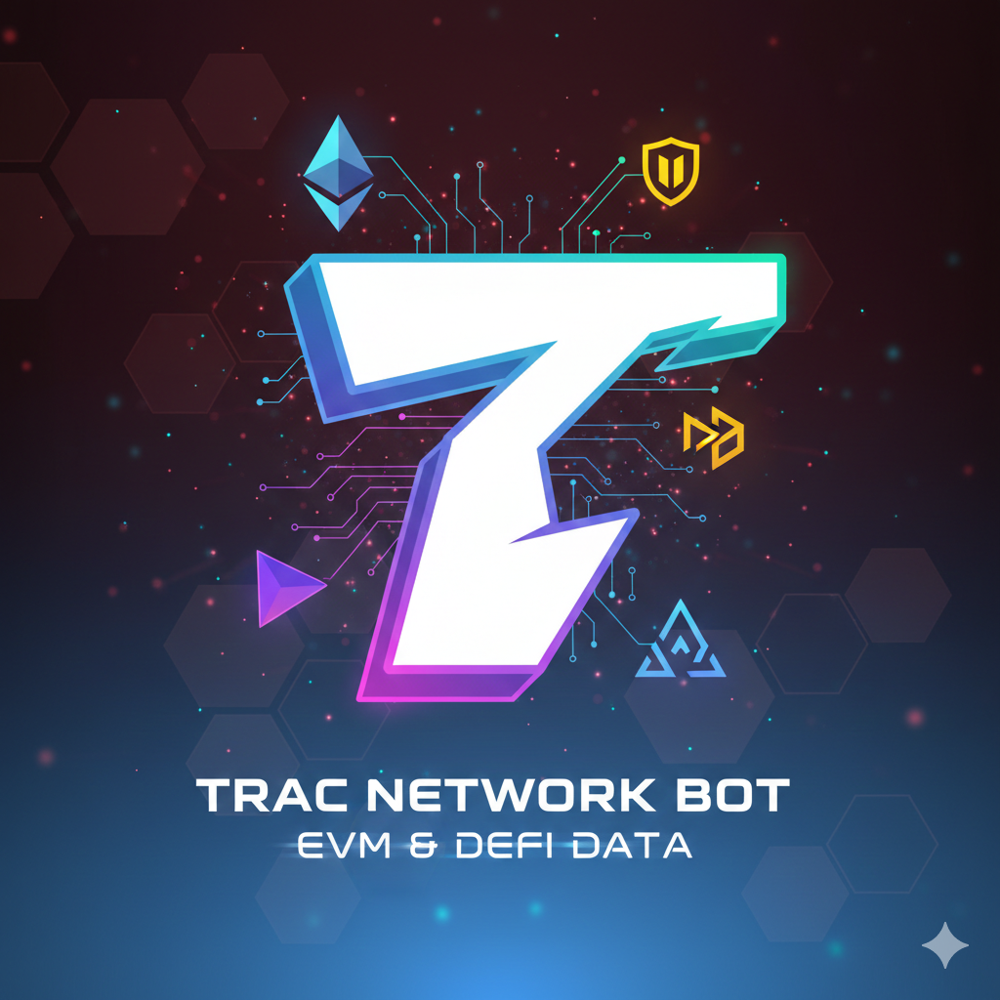

Trac addrrs>trac1zl3gu2jql3jwtcklnkq9qsu5u0hnvkm9pel2h4m0f7ylcfe43r7qlrvjtr


# 🤖 TRAC NETWORK BOT (v2.0 Stable)


> **The ultimate Telegram Bot for real-time EVM tracking and Blockchain visualization.**

TRAC Network Bot adalah asisten cerdas berbasis Python yang dirancang khusus untuk para pengembang, trader, dan antusias blockchain. Bot ini memberikan data harga real-time dari berbagai jaringan EVM (Ethereum Virtual Machine) langsung ke dalam chat Telegram Anda dengan tingkat stabilitas tinggi.

---

## 🚀 Fitur Unggulan

* **📊 Multi-Chain Dashboard**: Pantau harga berbagai jaringan utama (ETH, BSC, Polygon, Arbitrum, Optimism, Base, AVAX) dalam satu perintah.
* **📈 Smart Visualizer**: Integrasi link grafik real-time untuk analisis teknikal instan.
* **📉 24h Price Analytics**: Menampilkan persentase perubahan harga (bullish/bearish) dalam 24 jam terakhir.
* **🛡️ Anti-Crash Engine**: Dilengkapi dengan *exception handling* dan *auto-retry* untuk memastikan bot tetap online 24/7.
* **⚡ Lightweight & Fast**: Dioptimalkan untuk berjalan lancar di lingkungan mobile (Termux) maupun VPS.

---

## 🛠️ Arsitektur Teknologi

Bot ini dibangun menggunakan stack teknologi modern:
* **Bahasa**: [Python 3.12](https://www.python.org/)
* **Framework**: [pyTelegramBotAPI](https://github.com/eternnoir/pyTelegramBotAPI)
* **Data API**: [CoinGecko Pro API](https://www.coingecko.com/en/api)
* **Process Manager**: [PM2](https://pm2.keymetrics.io/) (Opsional untuk uptime 24/7)

---

## 📥 Instalasi di Termux

Pastikan Anda telah menginstal Python dan Git, lalu ikuti langkah berikut:

1.  **Clone Repository**
    ```bash
    git clone [https://github.com/leyzd/intercom.git](https://github.com/leyzd/intercom.git)
    cd intercom
    ```

2.  **Install Dependencies**
    ```bash
    pip install pyTelegramBotAPI requests
    ```

3.  **Konfigurasi Token**
    Buka `watcher.py` dan masukkan Token Bot dari @BotFather:
    ```python
    TOKEN = "YOUR_TOKEN_HERE"
    ```

4.  **Jalankan Bot**
    ```bash
    python watcher.py
    ```

---

## ⌨️ Daftar Perintah (Commands)

| Perintah | Deskripsi |
| :--- | :--- |
| `/evm` | Menampilkan dashboard harga seluruh jaringan EVM populer. |
| `/price` | Alternatif cepat untuk mengecek harga aset utama. |
| `/chart` | Mengambil link grafik interaktif untuk BTC, ETH, dan BNB. |
| `/start` | Menampilkan menu bantuan dan informasi interaksi. |

---

## 🔧 Menjaga Bot Tetap Hidup (24/7)

Agar bot tidak mati saat aplikasi ditutup, jalankan menggunakan PM2:
```bash
pkg install nodejs
npm install pm2 -g
pm2 start watcher.py --interpreter python

